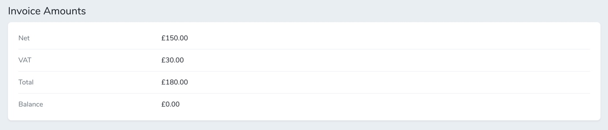
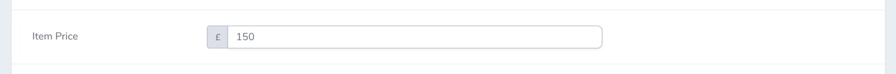

# Money Field for Laravel Nova

Custom money field for a Laravel Nova application I am working on. The default Currency field provided by Nova didn't quite cut the mustard for me so ended up creating this.

Formats the money value when creating/updating and displaying using the Brick\Money\Money package and adds a helpful currency icon to the create/edit field so you know what currency you should be using.




## Installing

You can install the package into your Nova application via composer:

```
compser require Jam0r85/nova-money
```

## Using
In your nova resource file, add the following into your Fields method:

```
use Jam0r85\NovaMoney\Money;

public function fields (Request $request)
{
	return [
		Money::make('Price'),
		// ...
	];
}
```

## Options
You can optionally add the column name to be used in storage if different from the display name as per any Nova field:
```
Money::make('Price', 'price_column');
```
The default currency is **GBP** but can be changed per field using currency()
```
Money::make('Price')->currency('USD');
```
The default locale is the one set as per the Laravel config('app.locale') file but can be changed per field using locale()
```
Money::make('Price')->locale('en_US');
```
By default we assume you are storing values as minor units (eg. £100 = 10000p) but you can change this with notMinor()
```
Money::make('Price')->notMinor();
```
This will automatically format all entered values into minor units so remember to remove/update any laravel setAttribute methods on your models!